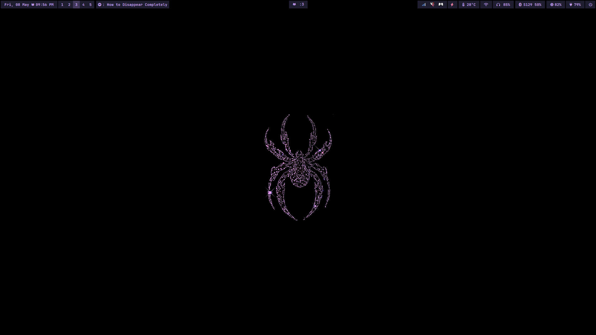

# dotfiles

my personal setup for arch linux + hyprland. i like keeping things fast, minimal, and out of the way so i can focus on writing code.

feel free to steal anything you like, but please don't blindly copy-paste my scripts unless you know what they do to your system :p

---

### the rice

> a quick look at the desktop environment.

<div align="center">
  
  <p><i>clean workspace</i></p>

  <br />
<video src="https://github.com/user-attachments/assets/a559e458-2bc6-4175-9c47-d9ae2b86e17c" width="100%" controls></video>
  <p><i>hyprland animations and workflow</i></p>
</div>

> wallpaper can be found [here](https://github.com/asitos/dotfiles/blob/main/assets/lavender-spiderman.png?raw=true)

---

### the stack

- **os:** arch linux
- **wm:** hyprland (wayland)
- **terminal:** kitty
- **bar:** waybar
- **shell:** bash
- **launcher:** rofi (wayland fork)

### structure

most of the interesting stuff is sitting right inside `/.config/`. 

```text
.config/
├── hypr/       # window manager rules, animations, and keybinds
├── kitty/      # terminal emulator styling
├── waybar/     # status bar layout and css
└── rofi/       # app launcher config
